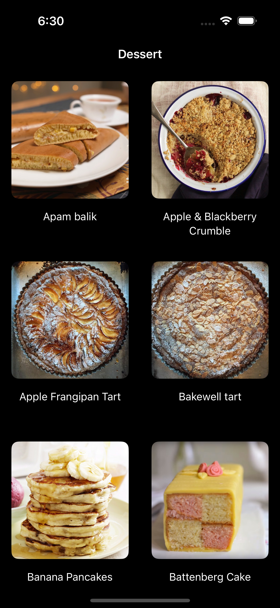
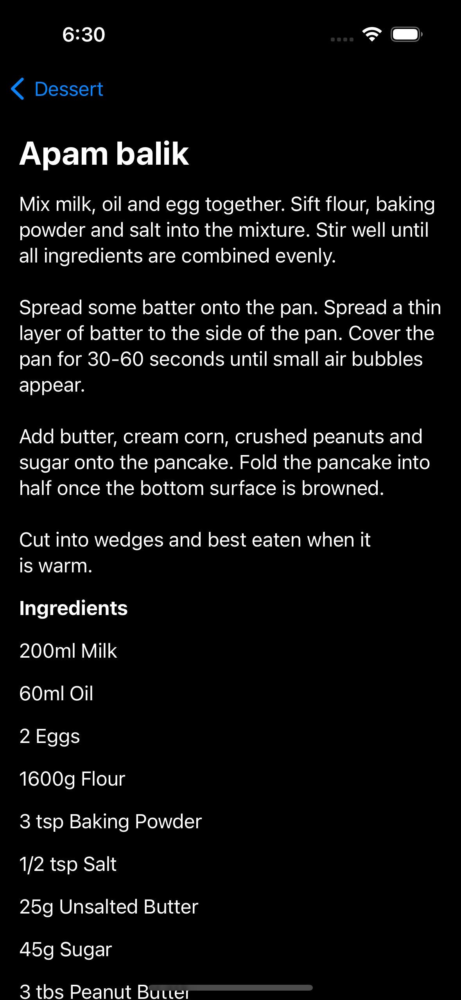

# Recipe Fetch App

### Description
This application utilizes the MVVM (Model-View-ViewModel) pattern alongside the Clean Architecture. It is structured into two separate modules: Data and Domain. These modules are organized within a Monorepo setup, managed through Swift Package Manager, and all reside under a single package.

### Stack

- SwiftUI
- MVVM + clean architecture
- async / await 
- Combine
- URLSession

#### Modules
- **Data Module**: Contains implementations related to repository, network, and local storage.
- **Domain Module**: Consists of repository protocols, use cases, and entities.

#### Presentation
1. AppDelegate - This class supervises the application's lifecycle and is also responsible for setting up the necessary Dependency Injection container used by the ViewModelFactory.

2. DIContainer (Dependency Injection Container) - This protocol is in charge of creating the required use cases and should be provided to view models that require these use cases. By implementing DIContainerImpl, we fulfill the DIContainer protocol, serving as the central hub for assembling all the components necessary for constructing use cases.

3. ViewModelFactory - The primary role of this class is to produce view models, including those that require specific use cases. In this context, the responsibility for creating view models does not fall on the views themselves; instead, it is managed by the ViewModelFactory.

#### Screenshots
 

